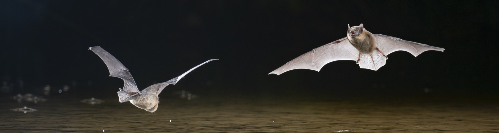
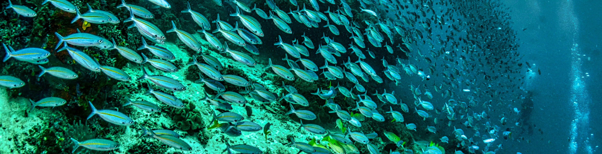

Les projets présentés ici illustrent mon travail à l’interface entre data science et sciences du vivant.  
Chaque fiche détaille le contexte, la méthodologie et les choix techniques.

## Détection automatique de chiroptères par intelligence artificielle    
    

Pipeline multi-modèles combinant détection, comptage par densité et classification d’espèces à partir d’images réelles.

- YOLO  
- CSRNet  
- Swin Transformer  
- Sélection dynamique via Random Forest  

[Voir la page projet](./project-page/bat_monitoring.md){: .btn .btn--primary}
[Tester la démo interactive](https://huggingface.co/spaces/ton-user/bat-demo){: .btn .btn--primary}

## Détection et quantification de poissons marins par ADN environnemental (ADNe)    

Analyse de données eDNA pour évaluer la capacité du metabarcoding à détecter et quantifier des assemblages de poissons marins.

- Pipeline Bash / Python / R  
- GLMM et analyses multivariées  
- Traitement de données haut débit  

[Voir la page projet](./project-page/edna_metabarcoding.md){: .btn .btn--primary}

## Veille Scientifique Automatisée    

Outil Python modulaire permettant de collecter, résumer et structurer automatiquement une veille thématique à partir de flux RSS.

- Collecte & scraping  
- Résumé automatique (Transformers)  
- Génération Markdown  
- Automatisation  

[Voir la page projet](./_projets/veille_automatique.md){: .btn .btn--primary}
[Voir le code](https://github.com/Apichevin/veille_automatique){: .btn .btn--primary}

## Projets à venir  

Developpement d'un outils de reconnaissance d'espèce sur pièges photo

